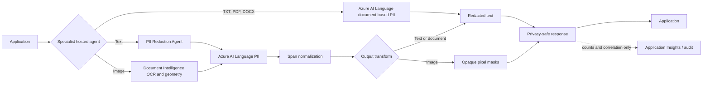

# Architecture

## Design goals

- Run deterministic protection before prompts reach generative models and after responses leave them.
- Keep original content in memory only and never place it in logs, traces, queues, or evaluation artifacts.
- Separate detection, policy, redaction transforms, hosting, and audit metadata.
- Use `DefaultAzureCredential` for local developer identity, workload identity, and managed identity.

## Request flow

## Service selection

| Capability | Service | Rationale |
| --- | --- | --- |
| Contextual PII | Azure AI Language | Names, addresses, identity categories, multilingual models |
| Native document PII | Azure AI Language document-based PII | Redacts TXT, PDF, and DOCX while preserving native layout |
| Document extraction and OCR geometry | Azure Document Intelligence | Locates image words for the Image Redaction Agent |
| Image PII masking | Document Intelligence + Azure AI Language | Maps detected PII spans back to irreversible pixel masks |
| General visual objects | Azure AI Vision | Planned extension for non-text objects and faces |
| Multimodal schema extraction | Azure AI Content Understanding | Planned complex document policies; keep behind an adapter |
| Harm categories | Azure AI Content Safety | Planned Content Safety and prompt-attack controls |
| Agent hosting and lifecycle | Microsoft Foundry | Managed hosted-agent runtime, identity, telemetry, and evaluation |

## Extension contract

New detectors implement `PiiDetector.detect()`. New redactors consume normalized `DetectedEntity` spans. Hosting adapters call the relevant shared service and must not duplicate policy or emit source values. The PII agent accepts text only; document and image transformations remain isolated in their own agents.
